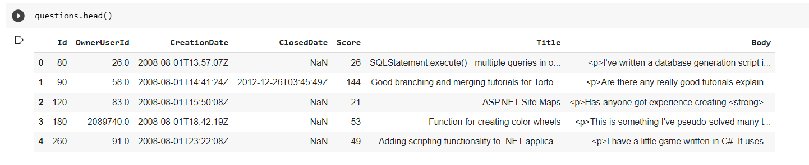
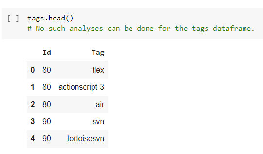
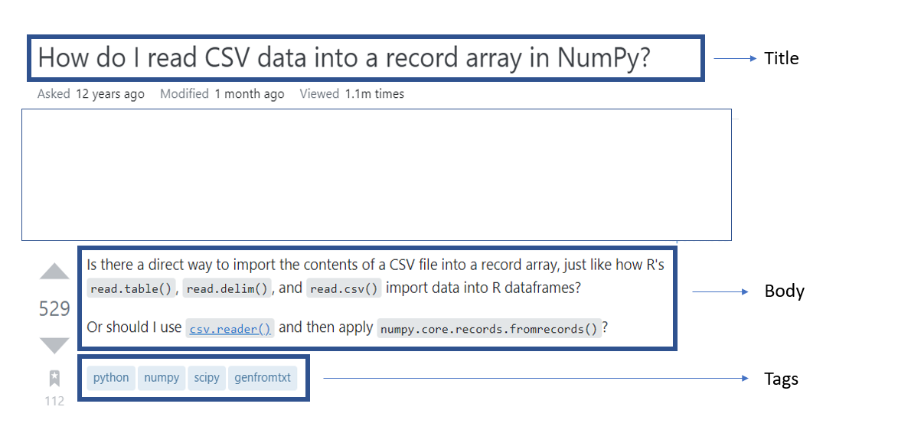
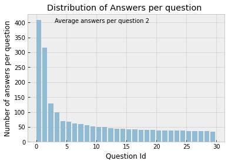
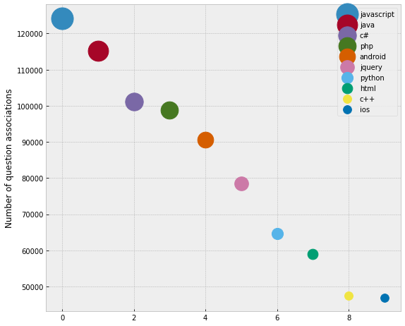
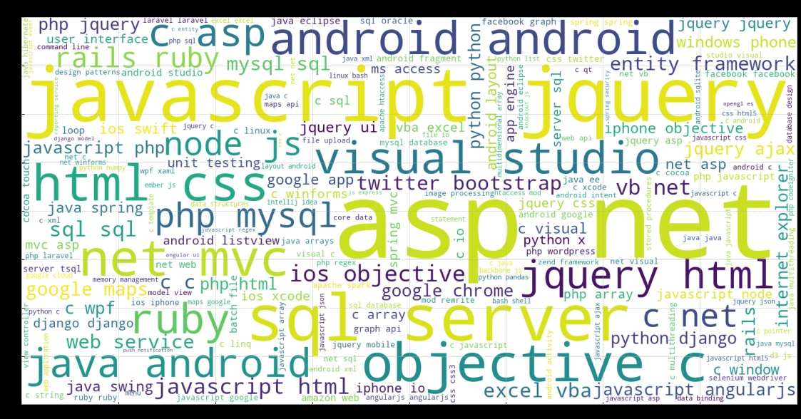
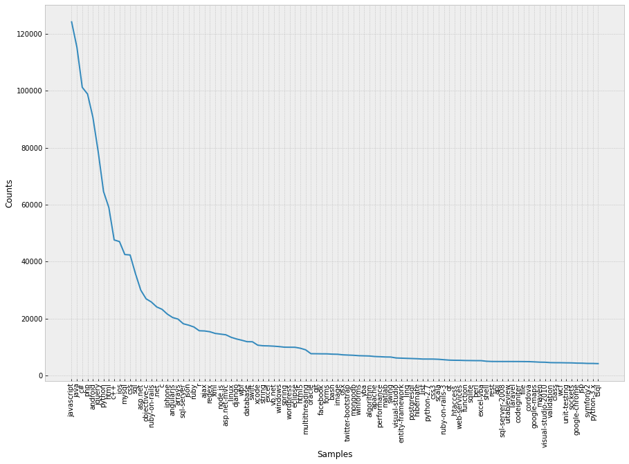
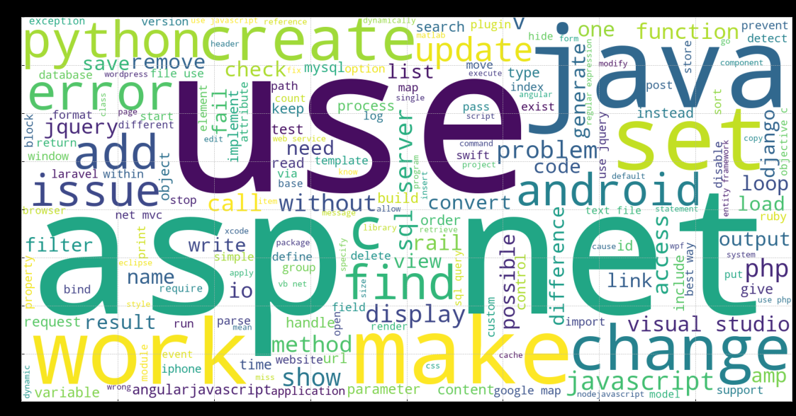
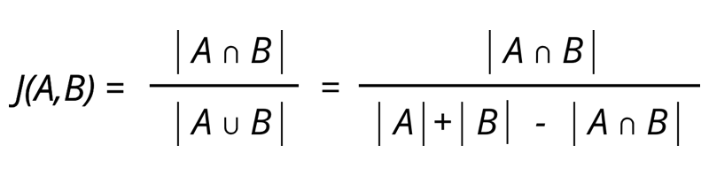
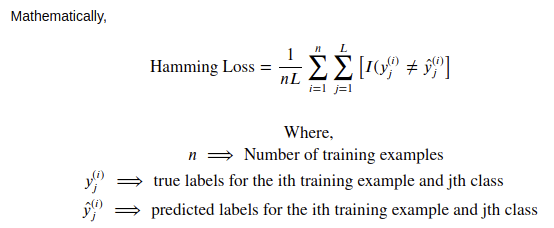

# Predicting Tags for StackOverflow Questions

## Summary

Stack Overflow is a community based Q&A website and is the largest online community for programmers to learn, share their knowledge, and advance their careers. It has been the single source of truth to answer programming questions for even the best of programmers. Along with having an active community that eagerly helps in providing answers to new questions, the sheer volume of of those questions asked is so large that it is impossible to prevent duplicate questions. Therefore, StackOverflow has come up with multiple solutions to prevent question replication. One of the solutions is to have a downvote button and another one of the solutions is to "TAG" the questions so that community members can search for the appropriate questions before having to ask the same question again. It does this using multiple methods like Text Processing, Neural Networks and various Machine Learning algorithms. This project is an humble effort to duplicate the "TAG" feature for StackOverflow questions. 

## Data Source

### Original Dataset 

The data was sourced from Kaggle and is part of a larger StackOverflow dataset that was extracted using Google's BigQuery data warehousing tool. The original dataset includes an archive of StackOverflow content, including posts, votes, tags, and badges. The dataset is updated to mirror the StackOverflow content on the Internet Archive, and is also available through the Stack Exchange Data Explorer. 

### Data Sampled

The dataset was downloaded from : https://www.kaggle.com/datasets/stackoverflow/stackoverflow

`The Python Notebook was created in Google Colab and since it provides a seamless integration with Google Drive, the datasets were manually downloaded and uploaded on Google Drive.`

The data that I used contains text from 10% of questions and tags from the original dataset. Since the main goal of this project is to create a model that given a question text predicts the tags, other data like votes, tags, badges have been removed. We have the data in form of two .csv files:  

1. **Questions.csv** : contains the title, body, creation date, closed date (if applicable), score, and owner ID for all non-deleted Stack Overflow questions whose Id is a multiple of 10.

2. **Tags.csv** : contains the tags on each of these questions

Please refer to the diagram below to understand the data. Upon initial analysis, it becomes evitable that it would be mandatory to merge the two datasets for model prediction. Therefore, in the next step, we start with merging, cleaning and truly understanding the data. 

## Data Cleaning

Before, we move on to the EDA, there were a bunch of steps performed in order to clean the data. The initial steps were to analyze if there were any null / na values, changing dtype objects with the correct data types (mostly String) 

### Merge Data
1. In order to merge the data, I grouped the tags by the Id of the question since a question can have multiple tags. I then used the groupby function to merge the dataframes on the `Id`. The Tags were stored as a space-separated string of Tags for every question. 
2. I separated the list into a list of individual tag strings. This makes it into a multi-label classification problem where 1 question can have multiple Tags associated with it. 

### Handle Duplicates
1. Used the pandas `duplicates()` function to find if there are any duplicates in the data.

### Handle Additional Attributes
1. Since columns like `'CreationDate', 'ClosedDate' and 'Score'` will not help us with predicting the Tags of the question, I have removed that data.

### Clean Text
1. Since the data was scraped from a website, the `Body` text had HTML elements like  `
, , etc`. This type of text information is particularly harmful for the models since the tag will not be dependent on these HTML elements. Therefore, we have used a library called `BeautifulSoup()` which helps extract only the textual information from the data and ignores the HTML elements.

## Exploratory Data Analysis

In order to understand the data, the following visualizations were analyzed
1. Distribution of Answers per question

2. 10 Most common tags in the questions

3. Word Cloud to highlight the most frequent tags in the data

4. Occurence of 370 most common tags in the data (3700 tags available: only viewing ~10%)

5. Word Cloud to highlight most frequent words in the title of the question

## Data Preparation
### Functions for preparing data

The following functions were created in order to prep the data for the ML classifiers: 

1. `clean_text()` : substitutes most common made errors while typing
2. `remove_punctuation()` : Removes punctuation marks `'!"#$%&\'()*+,./:;<=>?@[\\]^_{|}~'`
3. `lemmatize_words()` : Lemmatizes the words using the TokTokTokenizer in the NLTK library
4. `most_common_tags_and_keywords()` : returns a Tuple of most common tags and keywords

## Machine Learning Models (In Progress)

The following Machine Learning models were used to 

### DummyClassifier (Baseline Prediction)

The Dummy Classifier gives a measure of "baseline" performance that is the success rate one should expect to achieve even if simply guessing. It makes a prediction without finding any patterns in the data. In our use case, the dummy classifier predicts the tags based on most common tags in the training data set. Since our data is not balanced, we have some tags that occur more frequently than others. That is the reason why we have a similarity score of only around 44.7%. 

### Stochastic Gradient Classifier

SGD is an Stochastic Gradient Descent-based general optimization method. Stochastic Gradient Descent (SGD) is a simple yet very efficient approach to discriminative learning of linear classifiers under convex loss functions. Even though SGD has been around in the machine learning community for a long time, it has received a considerable amount of attention just recently in the context of large-scale  deep-learning.  optimizer which can optimize many different convex-optimization problems (actually: this is more or less the same method used in all those Deep-Learning approaches; so people use it in the non-convex setting too; throwing away theoretical-guarantees).

Following are the features of SGD classifiers:

    1. Scale better for huge-data in general
    
    2. Need hyper-parameter tuning
    
    3. Solve only a subset of the tasks approachable by the the above (no kernel-methods!)
    
In our use case, the SGD classifier gave us an average jaccard similarity value of 63.295%

### Logistic Regression Classifier

Logistic Regression is a statistical method for analyzing a dataset in which there are one or more independent variables that determine an outcome. The intention behind using logistic regression is to find the best fitting model to describe the relationship between the dependent and the independent variable. Since logistic regression works for binary target variables, in the multiclass case, the training algorithm uses the one-vs-rest (OvR) scheme which we have used. We use the Multinomial Logistic Regression where The target variable has three or more nominal categories such as predicting the type of wine.

Because of its efficient and straightforward nature, it doesn't require high computation power, is easy to implement, easily interpretable, and used widely by data analysts and scientists. Also, it doesn't require scaling of features. Logistic regression provides a probability score for observations.

### Multinomial Naive Bayes Classifier

The Multinomial Naive Bayes algorithm is a Bayesian learning approach popular in Natural Language Processing (NLP). The program guesses the tag of a text, such as an email or a newspaper story, using the Bayes theorem. It calculates each tag's likelihood for a given sample and outputs the tag with the greatest chance.  

The Naive Bayes method is a strong tool for analyzing text input and solving problems with numerous classes. Because the Naive Bayes theorem is based on the Bayes theorem, it is necessary to first comprehend the Bayes theorem notion. The Bayes theorem, which was developed by Thomas Bayes, estimates the likelihood of occurrence based on prior knowledge of the event's conditions. When predictor B itself is available, we calculate the likelihood of class A.

It is simple to implement because all you have to do is calculate probability. This approach works with both continuous and discrete data. It's straightforward and can be used to forecast real-time applications. It's very scalable and can handle enormous datasets with ease. This algorithm's prediction accuracy is lower than that of other probability algorithms. The Naive Bayes technique can only be used to classify textual input and cannot be used to estimate numerical values.

### Linear Support Vector Classifier

Linear Support Vector Machines (linear-svc) have been used successfully in many Natural Language Processing (NLP) tasks. Support Vector Machines (SVM) is a supervised machine learning algorithm, which has achieved state-of-the-art performance on many learning tasks. In particular, SVM is a popular learning algorithm for Natural Language Processing (NLP) tasks such as 

        1. POS (Partof-speech) tagging 
        2. word sense disambiguation
        3. NP (noun phrase) chunking
        4. information extraction
        5. relation extraction
        6. semantic role labeling 
        7. dependency analysis.
 
Almost all these applications adopt the same steps: first they transform the problem into a multi-class classification task and then apply svc; then convert the multiclass problem into several binary classification problems; then an SVM classifier is trained for each binary classification; and finally, the classifiers’ results are combined to obtain the solution to the NLP problem

### Perceptron 

The Perceptron algorithm is a two-class (binary) classification machine learning algorithm. In our case, we use the OneVRest classifier to turn it into a multi-class classifier. 

It is a type of neural network model, perhaps the simplest type of neural network model.

It consists of a single node or neuron that takes a row of data as input and predicts a class label. This is achieved by calculating the weighted sum of the inputs and a bias (set to 1). The weighted sum of the input of the model is called the activation.

Activation = Weights * Inputs + Bias
If the activation is above 0.0, the model will output 1.0; otherwise, it will output 0.0.

Predict 1: If Activation > 0.0
Predict 0: If Activation <= 0.0
Given that the inputs are multiplied by model coefficients, like linear regression and logistic regression, it is good practice to normalize or standardize data prior to using the model.

The Perceptron is a linear classification algorithm. This means that it learns a decision boundary that separates two classes using a line (called a hyperplane) in the feature space. As such, it is appropriate for those problems where the classes can be separated well by a line or linear model, referred to as linearly separable.

The coefficients of the model are referred to as input weights and are trained using the stochastic gradient descent optimization algorithm.

Model weights are updated with a small proportion of the error each batch, and the proportion is controlled by a hyperparameter called the learning rate, typically set to a small value. This is to ensure learning does not occur too quickly, resulting in a possibly lower skill model, referred to as premature convergence of the optimization (search) procedure for the model weights.

### Passive Aggressive Classifier

The Passive-Aggressive algorithms are a family of Machine learning algorithms that are not very well known by beginners and even intermediate Machine Learning enthusiasts. However, they can be very useful and efficient for certain applications.
How Passive-Aggressive Algorithms Work:
Passive-Aggressive algorithms are called so because:

1.	Passive: If the prediction is correct, keep the model and do not make any changes. i.e., the data in the example is not enough to cause any changes in the model. 
2.	Aggressive: If the prediction is incorrect, make changes to the model. i.e., some change to the model may correct it.
However, in our case, even though the sequential data was used, we did not get a good result on our training set. We got around 58% similarity index. 

## Optimize Model parameters 

I used GridSearch CV to optimize the parameters of our machine learning algorithms. However, since the size of our data is huge, I was not able to run the GridSearch optimization for all the models. 
1.	GridSearchCV on LinearSVC model (similarity improved to ~69% )
2.	GridSearchCV on SGD Classifier model (similarity improved to ~68%)	

## Accuracy Metrics

Following are the two metrics that are used in 
### 1. Jaccard Similarity Score 

#### Average Jaccard Similarity  
**Range** - 0% to 100%

The Jaccard Similarity Index is a measure of the similarity between two sets of data. The closer to 100, the more similar are the two sets of data. In our case, it looks for similarities in the predicted tags with the actual tags in the test data. The Jaccard similarity index is calculated as follows:

#### Hamming Loss
**Range** - 0 to 1 

The Hamming loss is the fraction of labels that are incorrectly predicted. Therefore, the lower the Hamming loss, the better prediction was achieved. The hamming loss is calculated as follows: 

| Classifier      | Dummy | Stochastic Gradient | Logistic Regression | MultiNomial NaiveBayes | LinearSVC | Perceptron | Passive Aggressive  |
| ----------- | ----------- | ----------- | ----------- | ----------- | ----------- | ----------- | ----------- | 
| Jaccard Similarity Score      | 44.749338109 | 63.2953905195 | **65.945366206** | 62.589124358 | 65.556819719 | 56.917706850 | 58.173815832 |
| Hamming Loss   | 0.2136659626      | 0.13003797740 | **0.12312183652**  |  0.1384444222 | 0.123706839 | 0.17178937647 | 0.16176346002 |

